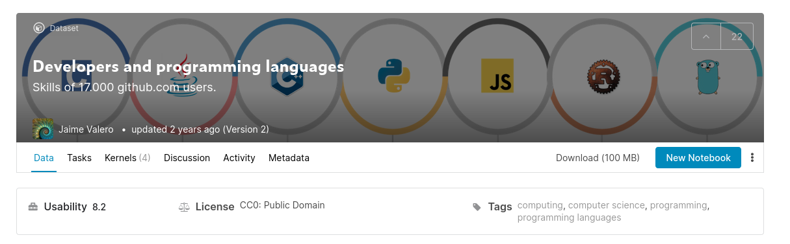

# Exercise 03.01 | Reading Data on GitHub Users

A user (Jaime Valero) made available a dataset on Kaggle about 17000 GitHub
users and their programming language choices.

Go to the Webpage, download the data and read it into a dataframe:

* [https://www.kaggle.com/jaimevalero/developers-and-programming-languages](https://www.kaggle.com/jaimevalero/developers-and-programming-languages)



Confirm that the dataframe has 17461 rows and 1411 columns.

----

# Discussion

You will find the download is a zip file (with SHA1 229d934ce5edf1131e0378ec71b1af529363cfd0).

```
$ sha1sum developers-and-programming-languages.zip
229d934ce5edf1131e0378ec71b1af529363cfd0  developers-and-programming-languages.zip
```

Unzip it, first.

```
$ unzip developers-and-programming-languages.zip
```

Import the pandas module.

```python
import pandas as pd
```

Then read the content into a DataFrame.

```python
df = pd.read_csv("user-languages.csv")
```

Check, wether you go the complete dataset by checking its shape.

```python
df.shape
```
